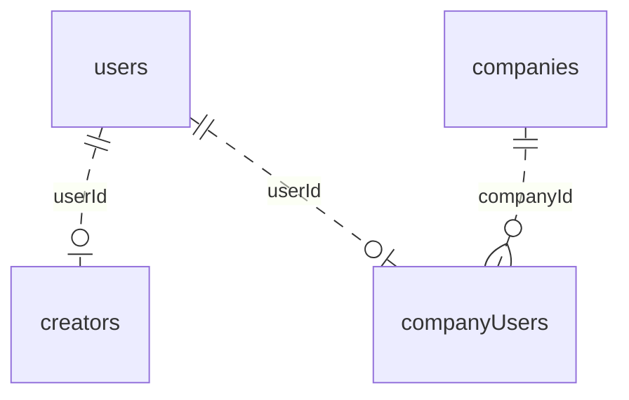
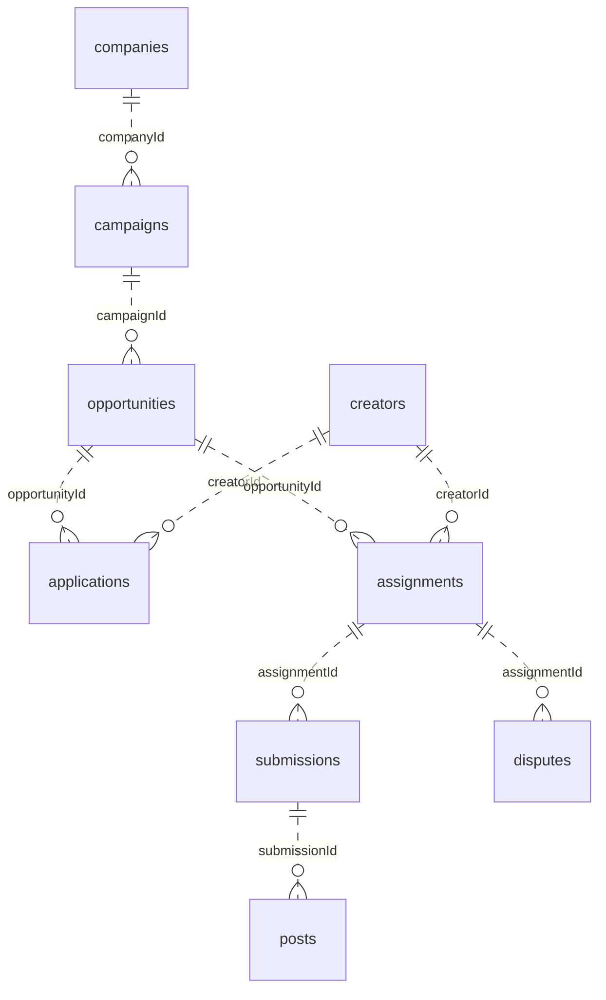

# Database

Tomoji's database follows the whiteboard redesign from issue #27. There are
**11 application tables**, registered in [`convex/schema.ts`](../convex/schema.ts).
Each table's fields, validators, and indexes live in
[`convex/schemas/`](../convex/schemas/).

This document explains what the records represent and how they connect. The
linked schema files are the reference for every field and index. For conventions
on writing routes and models, see [Backend](BACKEND.md).

## The main concepts

A **company** runs a **campaign**: the overall brief, audience, budget, and schedule.
A campaign can contain multiple **opportunities**, each describing an opening
for creators, its requirements, available slots, and default compensation.

An **application** tracks a creator's interest in an opportunity and the offer
status. An **assignment** records that creator's agreed work and compensation.
Both reference the creator and opportunity. An assignment currently has no
`applicationId`; accepting an application does not automatically create one.

A **submission** stores a draft and its review information. A **post** stores the
published URL and engagement metrics. A **dispute** belongs to an assignment and
records the issue and its resolution information.

These concepts describe the storage model. The newer workflow tables do not yet
have application routes that perform those lifecycle steps.

## Tables

### Accounts and companies

| Table                                                      | What one record represents                       | Key data                                                                                                |
| ---------------------------------------------------------- | ------------------------------------------------ | ------------------------------------------------------------------------------------------------------- |
| [`users`](../convex/schemas/users.schema.ts)               | A person's account and WorkOS identity.          | `workosId`, `email`, account `role`, `isActive`, optional `firstName`, `lastName`, and profile picture. |
| [`creators`](../convex/schemas/creators.schema.ts)         | A user's creator profile.                        | `userId`, optional `username`, X ID, GitHub link, and phone number.                                     |
| [`companies`](../convex/schemas/companies.schema.ts)       | A company associated with a WorkOS organization. | `workosId`, `name`, `isActive`, optional profile picture.                                               |
| [`companyUsers`](../convex/schemas/companyUsers.schema.ts) | A user's membership and role within a company.   | `userId`, `companyId`, company `role`.                                                                  |

### Campaigns and creator participation

| Table                                                        | What one record represents                                   | Key data                                                                                                                                                                   |
| ------------------------------------------------------------ | ------------------------------------------------------------ | -------------------------------------------------------------------------------------------------------------------------------------------------------------------------- |
| [`campaigns`](../convex/schemas/campaigns.schema.ts)         | The company's overall campaign brief.                        | `companyId`, `createdBy`, title, objective, product, audience, description, `budgetCents`, `startsAt`, optional `endsAt`.                                                  |
| [`opportunities`](../convex/schemas/opportunities.schema.ts) | An opening within a campaign.                                | `campaignId`, `createdBy`, title, description, targeting/gating, slots, application limit, deadline, status, compensation defaults, content requirements and usage rights. |
| [`applications`](../convex/schemas/applications.schema.ts)   | A creator's application and offer status for an opportunity. | `opportunityId`, `creatorId`, note, status, optional `offerExpiresAt` and `offerAcceptedAt`.                                                                               |
| [`assignments`](../convex/schemas/assignments.schema.ts)     | A creator's agreed work for an opportunity.                  | `opportunityId`, `creatorId`, agreed compensation, `usesAiReview`, status.                                                                                                 |

Opportunities store the default `fixedFeeCents`, `cpmRateCents`, and
`paymentCapCents`. Assignments store their own values for those same fields so
agreed terms can remain separate from editable opportunity defaults. The
opportunity's `usesAiReviewDefault` and assignment's `usesAiReview` follow the same
pattern. Copying or negotiating these values belongs in the future assignment
creation operation.

The opportunity's `prohibitedClaims` and `disclosureRequirements` are free-text
strings.

### Delivery and disputes

| Table                                                    | What one record represents                                    | Key data                                                                                                           |
| -------------------------------------------------------- | ------------------------------------------------------------- | ------------------------------------------------------------------------------------------------------------------ |
| [`submissions`](../convex/schemas/submissions.schema.ts) | A draft submitted for an assignment, with review information. | `assignmentId`, `draftUrl`, `draftDescription`, status, optional review note, and review attribution when present. |
| [`posts`](../convex/schemas/posts.schema.ts)             | A published post associated with a submission.                | `submissionId`, URL, `postedAt`, `isVerified`, likes, comments, reposts, views, `lastUpdatedAt`.                   |
| [`disputes`](../convex/schemas/disputes.schema.ts)       | An issue raised about an assignment.                          | `assignmentId`, `openedBy`, reason, description, status, optional `resolvedBy` and resolution.                     |

## Relationships

The diagrams show intended record relationships. `||` means exactly one, `o|`
means zero or one, and `o{` means zero or many. Parent records may have no children.
Convex does not automatically enforce the existence of a referenced record.

### Identity and membership



A user can belong to **at most one company**, and a company can have **many users**.
This is enforced by the membership-writing model: it looks up `companyUsers` by
`userId` and rejects a different company's membership before writing. The index
itself is not a uniqueness constraint.

The two roles serve different purposes:

- `users.role`: `creator`, `company`, or `operator` — the account's application role.
- `companyUsers.role`: `admin` or `member` — the user's role within that company.

Newly synced users start as creators and receive a creator profile without a
username. They can choose one through `creators.update`; signup does not currently
collect it. Existing usernames remain stored, and usernames are not required to
be unique. Username updates trim surrounding whitespace and reject empty or
whitespace-only values.

`username`, `firstName`, and `lastName` are optional for now in stored records and
API responses. A later PR will make them required after collection and backfill
are in place. WorkOS sync still fills missing name parts with empty strings;
records written without those fields are also valid.

The creator profile can remain when the account role changes to company or
operator. Its presence does not grant creator permissions; routes check the
account role.

### Campaign and delivery records



Authorship and review references supplement those main links:

- `campaigns.createdBy` and `opportunities.createdBy` reference `companyUsers`.
- A human submission review's `reviewedBy` references `companyUsers`.
- A dispute's `openedBy` and optional `resolvedBy` reference `users`.

The schema permits multiple applications or assignments for the same
creator/opportunity pair, multiple submissions per assignment, and multiple posts
per submission. Their indexes support lookups but do not enforce uniqueness.
Future operations must define any restrictions on duplicates and revisions.

## Statuses and reviews

Statuses are stored as ordinary strings. `v.union(v.literal(...), ...)` restricts
which strings are accepted; there is no separate database enum type.

| Table           | Allowed status values                                                                       |
| --------------- | ------------------------------------------------------------------------------------------- |
| `opportunities` | `draft`, `open`, `paused`, `closed`                                                         |
| `applications`  | `pending`, `offered`, `accepted`, `declined`, `rejected`, `offerExpired`, `opportunityFull` |
| `assignments`   | `termsPending`, `active`, `completed`, `cancelled`                                          |
| `submissions`   | `pending`, `approved`, `changesRequested`                                                   |
| `disputes`      | `open`, `resolved`                                                                          |

These validators restrict stored values. They do not define allowed transitions,
expire offers, fill slots, or trigger payments.

Submissions have three valid review shapes:

| Review shape          | Required review fields                                     | Allowed status        |
| --------------------- | ---------------------------------------------------------- | --------------------- |
| No review attribution | None; omit `reviewerType`, `reviewedBy`, and `reviewedAt`. | `pending`             |
| AI review             | `reviewerType: "ai"`, `reviewedAt`; omit `reviewedBy`.     | Any submission status |
| Human review          | `reviewerType: "companyUser"`, `reviewedBy`, `reviewedAt`. | Any submission status |

`reviewNote` is optional in every shape. An approved or changes-requested
submission therefore requires review attribution and a timestamp. A pending
submission may also retain valid review metadata.

## IDs, timestamps, money, and indexes

Convex adds `_id` and `_creationTime` to every document. `_id` is the document's
primary identifier. A user's `workosId` is the external authentication identifier,
not their Convex primary key; a company's `workosId` identifies its WorkOS
organization.

A field such as `creatorId: v.id("creators")` accepts a Convex ID for that table.
It does not automatically check that the creator exists, belongs to the caller,
or should be allowed in the relationship. Deleting a parent does not cascade to
its referencing records.

Timestamps use numbers representing Unix milliseconds. Monetary fields use cents;
`cpmRateCents` is cents per 1,000 eligible views. The schema does not include a
currency field or payment calculation. Campaign creation validates a nonnegative
safe-integer budget, finite timestamps, and an end strictly later than its start.
Other money and count fields currently use `v.number()` without those additional
numeric rules.

Indexes provide the intended access paths. For example, this query retrieves a
bounded sample of pending applications for one opportunity:

```ts
const applications = await ctx.db
  .query("applications")
  .withIndex("by_opportunityId_and_status", (q) =>
    q.eq("opportunityId", opportunityId).eq("status", "pending"),
  )
  .take(20);
```

The index narrows the lookup to that opportunity and status. A public endpoint
must still authorize access to the opportunity. Use pagination when a caller
needs to browse beyond a bounded sample. Calling `.unique()` checks that a lookup
returns at most one record; it does not create a uniqueness constraint.

## What is implemented today

Public operations exist for user queries, creator profiles, company management,
company-member listing, and campaign creation. Company updates and member listing
use the caller's stored membership for scope; operators can create, get, and list
companies. `campaigns.create` derives both `companyId` and `createdBy` from the
caller's membership rather than accepting them from the client.

User, creator, and company-member profile responses return `firstName` and
`lastName` separately when present. They do not include a combined `name` field.
Either name part may be omitted or an empty string; clients choose how to display
missing names.

Opportunities, applications, assignments, submissions, posts, and disputes have
schemas and indexes but no public workflow operations yet. Their lifecycle rules,
permissions, capacity accounting, expiry processing, and payment behavior remain
to be implemented. Historical author/reviewer retention also needs an explicit
policy: membership removal currently deletes the referenced `companyUsers` row.

WorkOS synchronization and the identity migrations are internal functions. The
WorkOS AuthKit and migrations components keep their own component data separately
from these 11 application tables.

## Main changes from the previous schema

- User names are stored and returned as separate, optional `firstName` and `lastName` fields.
- Creator profiles support an optional, user-chosen `username`.
- Campaign briefs and opportunity settings are separate records.
- The old `campaignCreators` table is replaced by applications and assignments.
- Submissions reference assignments; posts reference submissions and store
  publication details and metrics.

Schema changes do not rewrite existing data. The internal
[`identity migration`](../convex/migrations.ts) backfills user name fields.
Creator usernames remain optional and do not need a backfill.
Legacy campaign/workflow records require their own migration
if present. Any backfill must run with a schema that accepts both the old and new
record shapes before the required new fields are enforced.

The review changes also rename `applications.acceptedAt` to `offerAcceptedAt`
and change opportunity claims/disclosures from arrays to strings. Any deployment
with records in those earlier shapes needs a backfill before adopting the current
schema; the identity migrations do not cover those fields.

### Deploying over legacy data

The checked-in schema describes the current state, with the three identity fields
still optional. It is not a one-step upgrade for
a database containing legacy records: Convex validates existing records before
accepting a schema deployment, so a rejected deployment cannot install the new
migration functions.

Before deploying to another existing database:

1. Stop any dev watcher that could deploy a conflicting schema, confirm the
   deployment target, take a backup, and inspect its records, including the removed
   `campaignCreators` table. Removing a table from `schema.ts` does not delete or
   convert its stored records. If legacy workflow records exist, prepare the
   conversion described in step 3 before attempting any schema deployment.
2. For legacy users that still have `name`, first deploy a compatibility version
   that also accepts optional `name`. The current `firstName` and `lastName`
   fields and profile responses already tolerate missing name parts.
   The [migration tests](../convex/tests/migrations.test.ts) exercise this temporary
   schema; it is not deployed automatically. Run `migrations:backfillUserNames`
   through the internal `migrations:run` runner and verify completion before
   removing the legacy `name` field. Keep the new name parts optional in this PR;
   a later PR will require them. Workflow
   validators must remain compatible during this identity migration too.
3. If legacy workflow records exist, pause the rollout, retain compatible validators, and decide how
   to preserve their data before switching to the new relationships. New campaign
   fields such as `objective`, `product`, and `budgetCents` need explicit values;
   they cannot be inferred safely. Migrate parent records before referencing
   applications, assignments, submissions, and posts. Any archival alternative
   must be agreed and verified before removing the old records. This repository
   does not yet include that workflow-data migration. Keep the old table and
   references until conversion is verified.
4. Verify migrated records and their references against the current schema, then
   deploy it and resume the watcher if needed. An empty workflow
   database needs no workflow backfill.

On September 25, 2026, the personal development deployment `benevolent-cow-707`
had one user with migrated name parts and no records in campaigns,
`campaignCreators`, opportunities, applications, assignments, submissions, posts,
or disputes. That check does not establish the state of other deployments.
